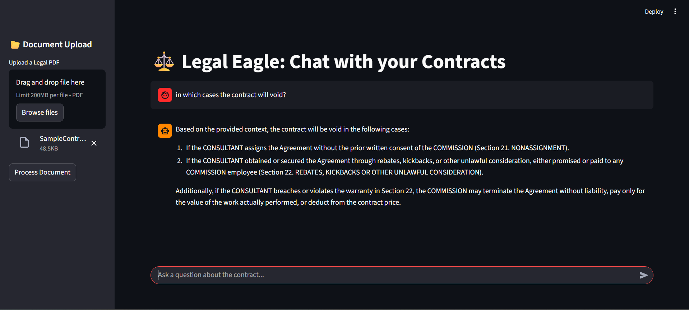

# ⚖️ Legal Eagle: AI-Powered Contract Assistant

Legal Eagle is a **Retrieval-Augmented Generation (RAG)** application designed to analyze complex legal documents. It allows users to upload PDF contracts and ask natural language questions, retrieving precise clauses and generating expert-level summaries using Llama-3.



### 🧠 How It Works (The RAG Pipeline)

- **Ingestion**: The app reads the uploaded PDF and splits text into semantic chunks (recursive character splitting).

- **Embedding**: It uses all-MiniLM-L6-v2 to convert text chunks into dense vector embeddings.

- **Storage**: Embeddings are stored locally in ChromaDB, a high-performance vector database.

- **Retrieval**: When a user asks a question, the system performs a semantic similarity search to find the top 3 most relevant contract clauses.

- **Generation**: These clauses are fed into Llama-3.1-8b (via Groq), which answers the question based strictly on the provided context.

### 🛠️ Tech Stack

- **LLM Engine**: Llama-3.1-8b (via Groq API)

- **Vector Database**: ChromaDB

- **Orchestration**: LangChain

- **Embeddings**: Sentence-Transformers (HuggingFace)

- **Frontend**: Streamlit

- **Language**: Python 3.10+

### 📂 Project Structure
```
legal-eagle/

├── app.py               # The main Streamlit application

├── ingest.py            # Standalone script for batch ingestion (optional)

├── query_engine.py      # Standalone CLI for testing retrieval logic

├── requirements.txt     # Python dependencies

└── README.md            # Documentation
```

### 🚀 Setup & Installation

**Prerequisites**

  - Python 3.10 or higher installed.
  
  - A free Groq API Key.

1. Clone the Repository
```
git clone [https://github.com/yourusername/legal-eagle.git](https://github.com/yourusername/legal-eagle.git)

cd legal-eagle
```

2. Install Dependencies
```
pip install streamlit langchain langchain-community langchain-chroma langchain-huggingface pypdf chromadb groq sentence-transformers
```

3. Configure API Key

Open `app.py` and paste your Groq API key:

`GROQ_API_KEY = "gsk_..."`


⚡ Usage

Run the App:
```
streamlit run app.py
```

**Upload**: Use the sidebar to upload a PDF contract (e.g., NDA, Lease).

**Process**: Click "Process Document" to build the vector database.

**Chat**: Ask questions like:

- "What is the termination notice period?"

- "Who is liable for water damage?"

## 🔮 Future Improvements

[ ] Multi-File Support: Allow chatting with multiple PDFs simultaneously.

[ ] Citation Highlighting: Show exactly which page the answer came from.

[ ] Chat History: Save session history to a database.

## 📄 License

MIT
